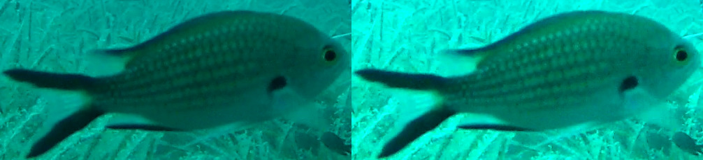
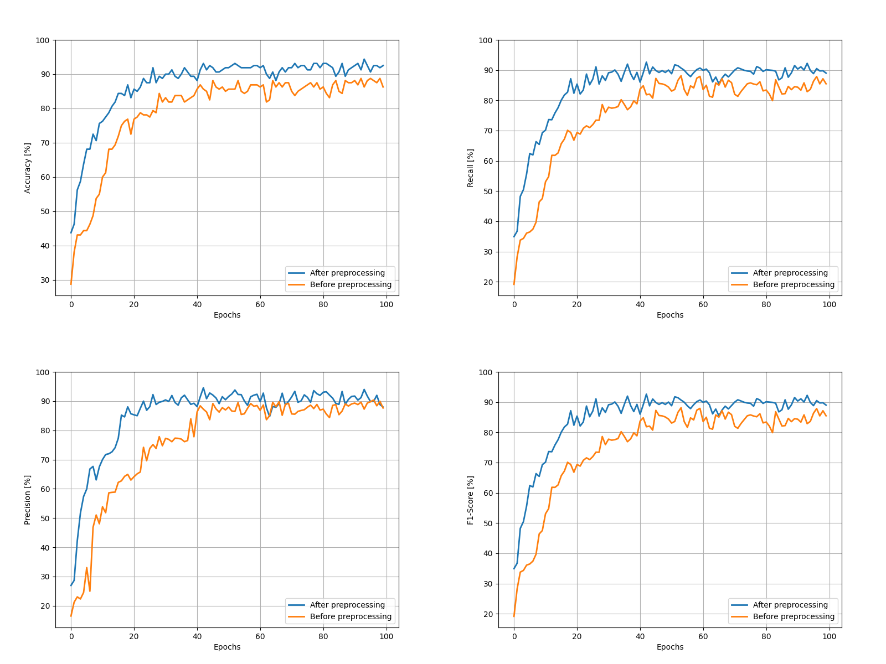
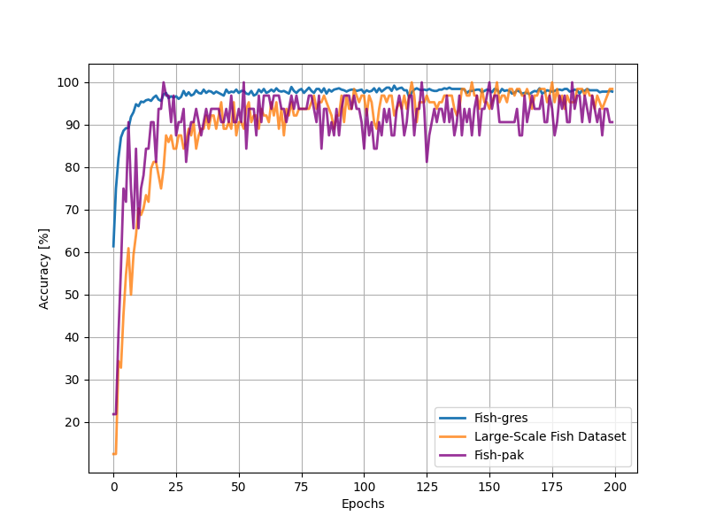
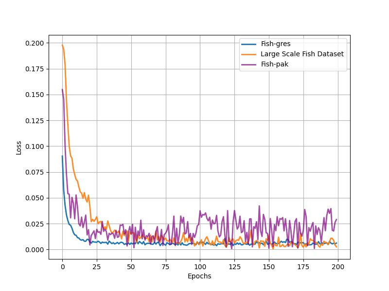
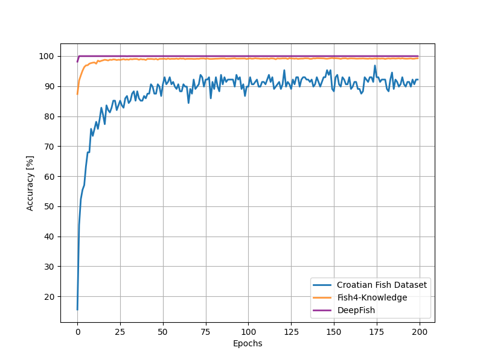
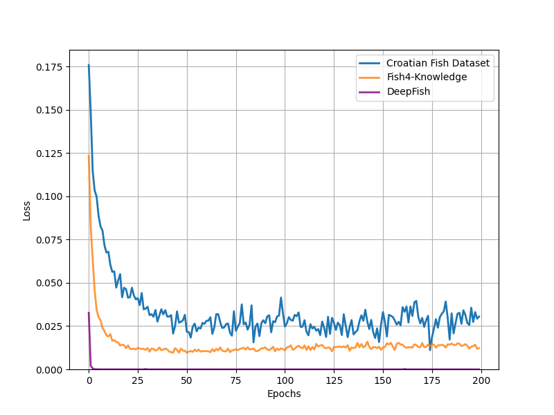
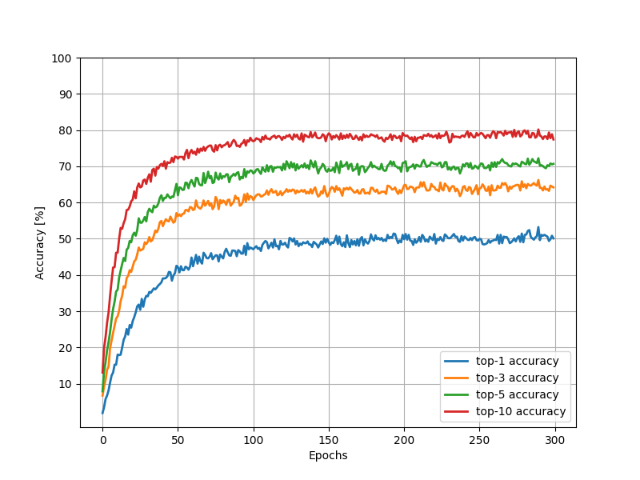

# Fine grained visual classfication of fish

This repository contains a project prepared for the IVUS 2024 conference (29th International Conference on Information Society and University Studies) and ICIST 2024 (30th International Conference on Information and Software Technologies) [Click for paper!](https://ceur-ws.org/Vol-3885/paper2.pdf). I developed a convolutional neural network (CNN) model for the problem of fine-grained visual classification. The datasets used for this project are:
1. Croatian Fish Dataset: prepared for the Machine Vision of Animals and their Behavior Workshop 2015 (doi: 10.5244/C.29.MVAB.6).
2. Fish4-Knowledge: Long-term underwater camera surveillance for monitoring and analysis of fish populations
3. DeepFish Dataset: A realistic fish-habitat dataset to evaluate algorithms for underwater visual analysis (doi: 10.1038/s41598-020-71639-x)
4. Fish-gres: Fish-gres Dataset for Fish Species Classification (doi: 10.17632/76cr3wfhff.1)
5. Large-Scale Fish Dataset: A Large-Scale Dataset for Fish Segmentation and Classification (doi: 10.1109/ASYU50717.2020.9259867)
6. Fish-pak: Fish-Pak: Fish species dataset from Pakistan for visual features based classification (doi: 10.1016/j.dib.2019.104565)
7. QUT: Local inter-session variability modelling for object classification (doi: 10.1109/WACV.2014.6836084)

Fine-grained visual classification (FGVC) involves classifying images belonging to the same meta-class. This problem is challenging due to the small differences between classes and the limited amount of data available. In this case, the dataset contains only 794 images of fish belonging to one of twelve classes.

Throughout this project, I had to work with low-resolution data; some images were as small as 30x25 pixels. Additionally, the images were blurry and exhibited a blue shift, a consequence of the nature of the photos taken. To address this, I performed simple image preprocessing: each image was brightened and resized to 64x64 pixels. Furthermore, data augmentation techniques such as horizontal and vertical flipping were applied.

I designed a custom CNN model with a CBAM attention module (https://arxiv.org/abs/1807.06521) and skip connections inspired by Densenet (https://pytorch.org/hub/pytorch_vision_densenet/). This model achieved an accuracy of 94.375%. In comparison, the authors of the dataset achieved 66.75% accuracy using a pre-trained ImageNet model for feature extraction and an SVM classifier.

# Results (IVUS 2024):
Below are the results of the model on the test set for Croatian Fish Dataset:

# Results (ICIST 2024): 

1. Images of fishes taken out of the water

2. Images of fishes taken underwater

3. QUT

