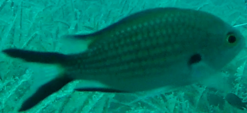
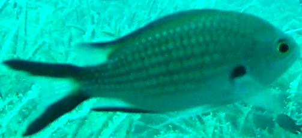
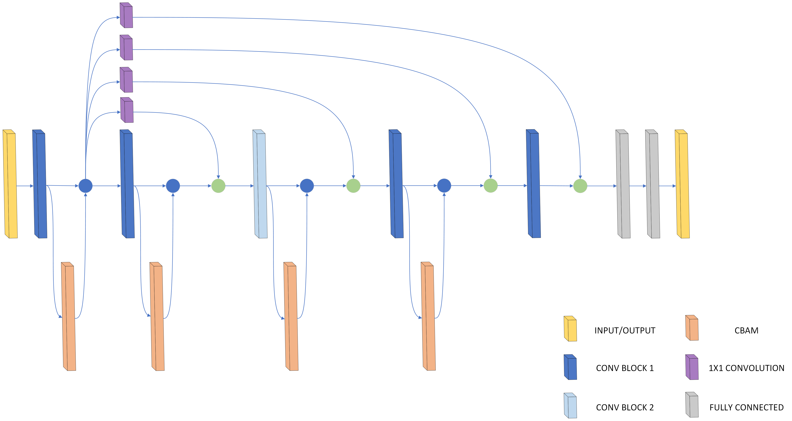

# Fine-grained-visual-classfication-of-fish

This repository contains a project prepared for the IVUS2024 conference (29th International Conference on Information Society and University Studies). I developed a convolutional neural network (CNN) model for the problem of fine-grained visual classification. The dataset used is the Croatian Fish Dataset prepared for the Machine Vision of Animals and their Behavior Workshop 2015 (doi: 10.5244/C.29.MVAB.6).

Fine-grained visual classification (FGVC) involves classifying images belonging to the same meta-class. This problem is challenging due to the small differences between classes and the limited amount of data available. In this case, the dataset contains only 794 images of fish belonging to one of twelve classes.

Throughout this project, I had to work with low-resolution data; some images were as small as 30x25 pixels. Additionally, the images were specifically blurred and tinted blue. To address this, I performed simple image preprocessing: each image was brightened and resized to 64x64 pixels. Furthermore, data augmentation techniques such as horizontal and vertical flipping were applied.

    
    

I designed a custom CNN model with a CBAM attention module and skip connections inspired by Densenet. This model achieved an accuracy of 94.375%. In comparison, the authors of the dataset achieved 66.75% accuracy using a pre-trained ImageNet model for feature extraction and an SVM classifier.

